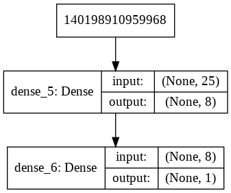

# A simple feed forward neural network for classification of DDoS attack packets

## Architecture of the model



## Usage

Run the ```ann.ipynb``` notebook.

## Dataset used
[Intrusion detection evaluation dataset (ISCXIDS2012)](https://www.unb.ca/cic/datasets/ids.html) was used for training and testing. 

## Results

### Plot of accuracy


### Plot of loss


